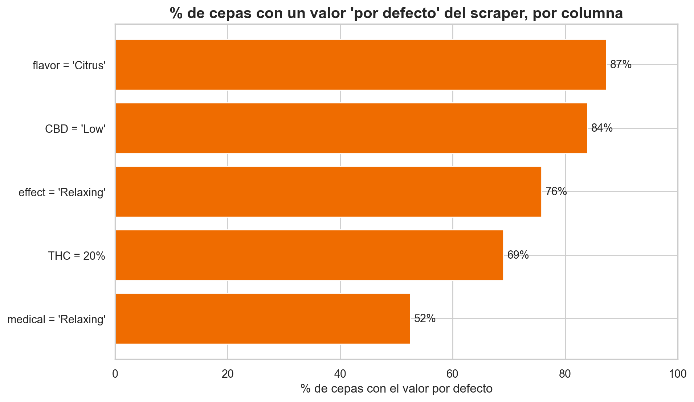
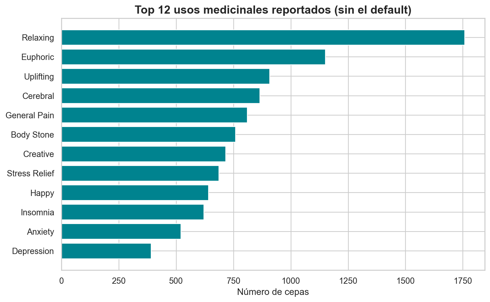
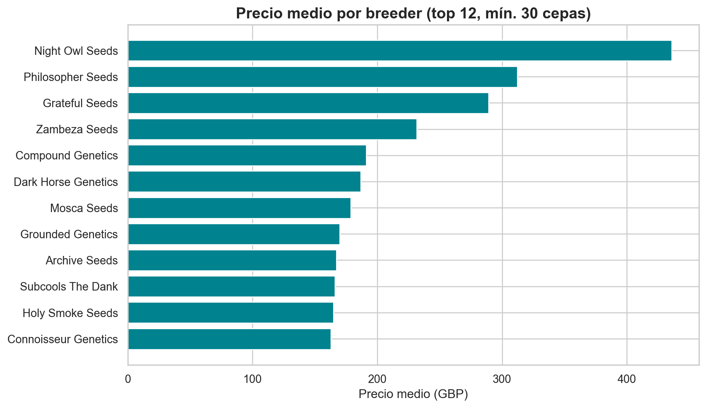

# 🌿 Cannabis Strains — Análisis Exploratorio de Datos (EDA)


### 🔗 [**Ver el reporte visual en vivo →**](https://arboledaleon.github.io/cannabis-eda-project/)

> Análisis exploratorio de **8.910 cepas de cannabis** desde una doble perspectiva:
> **químico-medicinal** (THC, CBD, efectos, usos terapéuticos) y **de mercado** (precios, descuentos, breeders).

Proyecto de portafolio en ciencia de datos. Autor: **León** — Ingeniería Biomédica.



_El hallazgo central: el dataset parece limpio (0% nulos), pero entre el 52% y 87% de cada columna clave es
un valor por defecto del scraper. El verdadero trabajo fue separar la señal del relleno._

## 📊 El dataset

- **Fuente:** [Cannabis Strains — Hugging Face](https://huggingface.co/datasets/JonusNattapong/cannabis-strains)
- **Tamaño:** 8.910 cepas × 38 columnas (scrape de una tienda de semillas; precios en £ GBP).
- **Documentación completa de columnas:** [`docs/DICCIONARIO_DATOS.md`](docs/DICCIONARIO_DATOS.md)

## 🎯 Preguntas que responde el análisis

- ¿Cómo se distribuyen el THC y el CBD? ¿Qué tan potentes son las cepas típicas?
- ¿Qué efectos y usos medicinales son más comunes?
- ¿Se diferencian Indica, Sativa e Híbrido en su química?
- ¿Qué determina el **precio** de una cepa? ¿La potencia, el breeder, otra cosa?

## 🗂️ Estructura del proyecto

```
├── data/            # Datos (CSV, no versionados). Ver data/README.md
├── notebooks/       # 00_carga → 01_exploracion → 02_limpieza → 03_eda_narrado
├── src/             # Código reutilizable (carga, limpieza, estilo de gráficos)
├── images/          # Gráficos exportados
├── docs/            # Diccionario de datos, flujo de trabajo, bitácora de decisiones
└── CLAUDE.md        # Contexto del proyecto
```

## 🛠️ Tecnologías

Python · pandas · NumPy · Matplotlib · Seaborn · WordCloud

## 🚀 Cómo reproducirlo

```bash
pip install -r requirements.txt
# El dataset ya está en data/cannabis_raw.csv. Abre los notebooks en orden (00 → 03).
```

## 📈 Resultados principales

- **Calidad de datos:** el "0% de nulos" es engañoso — entre el **52% y 87%** de cada columna clave es un
  valor por defecto del scraper (THC=20%, CBD='Low', efecto='Relaxing', sabor='Citrus').
- **Química:** catálogo de **alto THC y bajo CBD**; el tipo Indica/Sativa/Híbrido apenas diferencia la
  potencia; THC y CBD tienen correlación moderada negativa (r = −0,69).
- **Medicina:** usos reales más citados — dolor, estrés, insomnio, ansiedad y depresión.
- **Mercado:** el precio (mediana £19) lo determina el **breeder** (de £11 a £436, ~40×), **no** la potencia.

| Usos medicinales reales | El precio lo pone la marca |
|---|---|
|  |  |

El análisis completo y narrado está en [`notebooks/03_eda_narrado.ipynb`](notebooks/03_eda_narrado.ipynb).

---
<sub>Análisis y documentación en español; código en inglés (estándar profesional).</sub>
